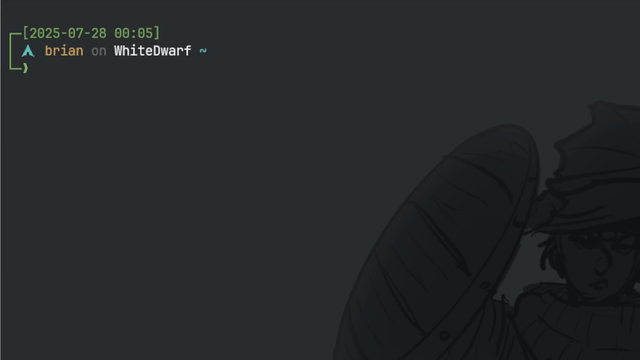

# VimWizards

```
	╦  ╦╦╔╦╗╦ ╦╦╔═╗╔═╗╦═╗╔╦╗╔═╗
	╚╗╔╝║║║║║║║║╔═╝╠═╣╠╦╝ ║║╚═╗
	 ╚╝ ╩╩ ╩╚╩╝╩╚═╝╩ ╩╩╚══╩╝╚═╝
```

A terminal-based arcade game where you control a wizard using Vim movement commands. Navigate the arena, collect power crystals, and avoid your growing ley-trail in this retro-style challenge.

VimWizards is a hackathon project made thanks to [boot.dev](https://blog.boot.dev/news/hackathon-2025/).

## Play Now
[](https://youtu.be/-OxVP4ZrVDE)

### Option 1: Play Online (Recommended)
```bash
ssh vimwizard@vimwizards.sh
```
Compete with other players on the global leaderboard!

### Option 2: Play Locally

**Requirements**:
- Python 3
- Pip

```bash
git clone https://github.com/ulises-gomez-dev/vim-wizards.git
cd vim-wizards
./quickstart.sh
```

## Game Overview

VimWizards combines the precision of Vim movement commands with classic snake-game mechanics. Your wizard (W) navigates an arena collecting crystals while avoiding collision with their own magical trail.

### Arena States

**Starting Arena:**
```
     A B C D E F G H I J   
   +----------------------+
 1 | W . . . . . . . . . |
 2 | . . . . . . . . . . |
 3 | . . . . . . . . . . |
 4 | . . . . . . . . . . |
 5 | . . . . ♦ . . . . . |
 6 | . . . . . . . . . . |
 7 | . . . . . . . . . . |
 8 | . . . . . . . . . . |
 9 | . . . . . . . . . . |
10 | . . . . . . . . . . |
   +----------------------+
```

**Mid-Game with Trail:**
```
     A B C D E F G H I J   
   +----------------------+
 1 | . . . . . . . . . . |
 2 | . . . . . o . . . . |
 3 | . . . . W o . . . . |
 4 | . . . . o o . . . . |
 5 | . . . . . . . ♦ . . |
 6 | . . . . . . . . . . |
 7 | . . . . . . . . . . |
 8 | . . . . . . . . . . |
 9 | . . . . . . . . . . |
10 | . . . . . . . . . . |
   +----------------------+
```

**Playing with Portals:**
```
     A B C D E F G H I J   
   +----------------------+
 1 | . . . . . . . . . . |
 2 | . . . . @ o o o o o |
 3 | . . . . . . . . . o |
 4 | . . . . @ . . . . o |
 5 | . . . . o . . . . o |
 6 | o . . . W . . . . o |
 7 | o . . . . . . ♦ . o |
 8 | o . . . . . . . . o |
 9 | o o o o o o o o o o |
10 | . . . . . . . . . . |
   +----------------------+
```

### Controls

- **h** - Move left
- **j** - Move down  
- **k** - Move up
- **l** - Move right
- **0** - Teleport to start of row
- **$** - Teleport to end of row
- **#G** - Create portal (# = row number)
- **:q!** - Quit game

## Architecture

VimWizards is built with clean, modular Python code:

### Core Components

**main.py** - Game Loop & Input Handler
- Manages terminal I/O using the `blessed` library
- Implements Vim-style movement command processing
- Handles game state and continuous rendering loop
- Coordinates between game objects and display

**game.py** - Game Logic Classes
- `Arena`: 2D grid management with *artisanal* coordinate system
  - Even-numbered X coordinates (0, 2, 4...) for proper spacing
  - Dynamic object rendering and cleanup
  - Border rendering with row/column labels
- `Wizard`: Player character with movement and collision detection
  - Trail management that grows with collected crystals
  - Portal creation and teleportation "logic"... Silly wizard can lock themself out of their own portal.
- `Crystal`: Collectible objects that increase score and orb trail length
  - Smart spawning that avoids occupied spaces

**Supporting Modules**
- `menu.py`: Main menu with ASCII art logo
- `database.py`: SQLite score persistence
- `game_over.py`: Game over screen with score entry

### Technical Details

- **Coordinate System**: X coordinates use even numbers (0, 2, 4...) due to terminal character spacing
- **Movement Vectors**: Adjusted for double-spaced grid (h: -2, l: +2, j: +1, k: -1)
- **Rendering**: ANSI escape sequences for efficient screen clearing
- **Input Mode**: Terminal `cbreak()` mode for immediate key response
- **State Management**: Clean separation between game logic and display

## Requirements

- Python 3.7+
- blessed (terminal formatting library)

## Development

### Key Design Patterns
- Object-oriented design for game entities
- Composition for wizard-arena relationship
- Event-driven input handling
- State pattern for game flow

## Contributing

Feel free to submit issues and enhancement requests!
We plan to add additional features like a near infinitely expanding arena, better layout, enemies that want you dead, and MORE VIM COMMANDS!

## License

MIT License - see LICENSE file for details

